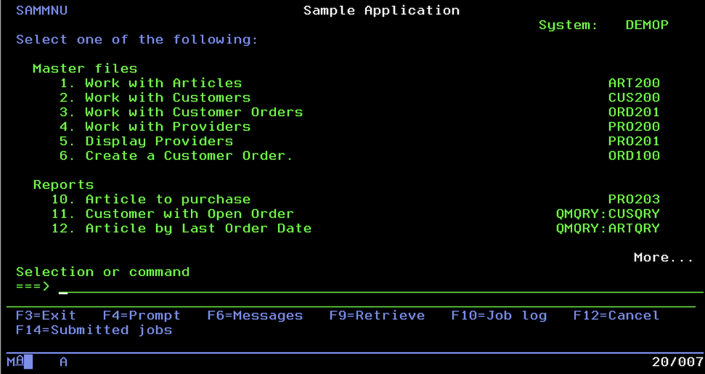

# IBM i Modernization Labs 101 - Getting Started with Bob

## Overview

Three simple 15-minute labs to learn IBM i modernization using IBM Bob AI assistant. Each lab focuses on one practical use case you can complete quickly.

The application SAMCO is a simple order management system. It has a green screen interface and RPG code that is over 20 years old. It is a good example of a system that could benefit from modernization.


---

## 🎯 The Labs

### Lab 101-1: RPG Fixed-to-Free Conversion
**Time**: 15 minutes | **File**: [lab1-rpg-documentation-fixed-to-free.md](lab1-rpg-documentation-fixed-to-free.md)

**What You'll Do:**
- Ask Bob to explain legacy RPG code
- Convert one subroutine from Fixed to Free format
- Replace magic numbers with named constants

**Use Case**: Convert the subfile load logic (s01lod) to modern RPG

---

### Lab 101-2: Build a Simple Article List
**Time**: 15 minutes | **File**: [lab2-ui-modernization-react-carbon.md](lab2-ui-modernization-react-carbon.md)

**What You'll Do:**
- Ask Bob to show you the green screen layout
- Create sample data with Bob's help
- Build a modern web table with search

**Use Case**: Display articles in a web browser using Carbon Design System

---

### Lab 101-3: Convert RLA to SQL
**Time**: 15 minutes | **File**: [lab3-dds-to-sql-rla-refactoring.md](lab3-dds-to-sql-rla-refactoring.md)

**What You'll Do:**
- Ask Bob to explain a CHAIN operation
- Convert it to SQL SELECT
- Use JOIN to get related data in one query

**Use Case**: Convert article lookup from RLA to SQL with JOIN

---

## 🚀 Quick Start

### Prerequisites
- VS Code with this project open
- IBM Bob AI assistant available
- For Lab 2: Node.js installed

### Start Any Lab
1. Open the lab markdown file
2. Follow the steps in order
3. Copy the prompts and ask Bob
4. Review Bob's responses
5. Complete the success criteria

---

## 💡 How to Use These Labs

### Working with Bob

Each lab has **specific prompts** to ask Bob. For example:

```
@SAMCO/QRPGLESRC/ART200-Work_with_article.PGM.SQLRPGLE

Explain what the s01lod subroutine does (lines 102-118).
```

**Tips:**
- ✅ Copy the prompt exactly as shown
- ✅ Include the @ file reference when specified
- ✅ Read Bob's response carefully
- ✅ Ask follow-up questions if unclear

---

## 📚 What You'll Learn

### Lab 1 Skills
- Understanding legacy RPG code
- Fixed-to-Free format conversion
- Using procedures instead of subroutines
- Named constants for maintainability

### Lab 2 Skills
- Visualizing green screen layouts
- Creating sample data
- Building modern web UIs
- Using Carbon Design System components

### Lab 3 Skills
- Understanding RLA operations
- Converting to SQL
- Using JOINs for related data
- SQL performance benefits

---

## 🎓 Learning Path

**Recommended Order:**

```
Start Here
    ↓
Lab 101-1 (RPG Basics)
    ↓
Lab 101-3 (SQL Conversion)
    ↓
Lab 101-2 (Web UI)
    ↓
Done! 🎉
```

**Or start with Lab 2** if you want to see the web UI first!

---

## ✅ Success Criteria

### Lab 1
- [ ] Bob explained the Fixed format code
- [ ] Code converted to Free format
- [ ] Magic number replaced with constant

### Lab 2
- [ ] Green screen layout visualized
- [ ] Sample data created
- [ ] Article list displays in browser
- [ ] Search works

### Lab 3
- [ ] CHAIN operation explained
- [ ] Converted to SQL SELECT
- [ ] JOIN added for related data
- [ ] Benefits understood

---

## 🔧 Troubleshooting

### Bob Not Responding?
- Check your connection
- Try rephrasing the question
- Make sure file references are correct

### Lab 2 - npm install fails?
```bash
cd article-management-web
rm -rf node_modules package-lock.json
npm install
```

### Lab 3 - SQL syntax errors?
- Check the ART400.SQLRPGLE file for working examples
- Ask Bob to explain the error

---

## 📖 Reference Files

These files are used in the labs:

| File | Used In | Purpose |
|------|---------|---------|
| `SAMCO/QRPGLESRC/ART200-Work_with_article.PGM.SQLRPGLE` | Lab 1, 3 | Legacy RPG program |
| `SAMCO/QDDSSRC/ART200D-Work_with_Article.DSPF` | Lab 2 | Green screen definition |
| `SAMCO/QRPGLESRC/ART400.SQLRPGLE` | Lab 3 | Modern SQL example |
| `article-management-web/` | Lab 2 | React application |

---

## 🎯 After Completing the Labs

### What's Next?

**Expand Your Skills:**
- Convert more subroutines in ART200
- Add edit/delete to the web UI
- Convert more RLA operations to SQL

**Apply to Your Code:**
- Identify similar patterns in your applications
- Start with small, low-risk changes
- Use Bob to help with conversions

**Learn More:**
- Explore the full ART400 service program
- Study the complete React application
- Review the modernization-plan/ directory

---

## 💬 Getting Help

**Ask Bob:**
- "Explain this code to me"
- "How do I convert this to Free format?"
- "What's the SQL equivalent of this RLA operation?"
- "Show me an example of..."

**Common Questions:**

**Q: Do I need an IBM i system?**  
A: Not for Lab 2. Labs 1 and 3 work with code files only.

**Q: Can I skip labs?**  
A: Yes! Each lab is independent.

**Q: How long does each lab really take?**  
A: 15 minutes if you follow the prompts. Take longer if you want to explore!

---

## 📝 Lab Format

Each lab follows this simple structure:

1. **Overview** - What you'll build
2. **Prerequisites** - What you need
3. **Use Case** - The practical example
4. **Steps** - 4-5 simple steps with Bob prompts
5. **Success Criteria** - How to know you're done
6. **Key Takeaways** - What you learned
7. **Next Steps** - Where to go from here

---

## 🌟 Tips for Success

1. **Follow the Prompts**: They're designed to work with Bob
2. **Read Bob's Responses**: Don't just copy code, understand it
3. **One Step at a Time**: Complete each step before moving on
4. **Ask Questions**: Bob is there to help - use it!
5. **Have Fun**: Modernization doesn't have to be scary!

---

## 📊 Time Breakdown

| Lab | Setup | Steps | Review | Total |
|-----|-------|-------|--------|-------|
| Lab 1 | 2 min | 10 min | 3 min | 15 min |
| Lab 2 | 2 min | 10 min | 3 min | 15 min |
| Lab 3 | 2 min | 10 min | 3 min | 15 min |
| **All 3** | | | | **45 min** |

---

## 🎉 Congratulations!

After completing these labs, you'll know how to:
- ✅ Use Bob to understand and modernize RPG code
- ✅ Build modern web interfaces for IBM i applications
- ✅ Convert RLA operations to SQL
- ✅ Apply these patterns to your own code

**Keep learning and modernizing!** 🚀

---

## 📚 Additional Resources

- **IBM Bob Documentation**: Ask Bob "How do I use you effectively?"
- **Carbon Design System**: https://carbondesignsystem.com/
- **RPG Cafe**: https://www.rpgpgm.com/
- **IBM i Modernization**: https://www.ibm.com/support/pages/ibm-i-modernization

---

*These labs are designed for beginners. No prior modernization experience required!*