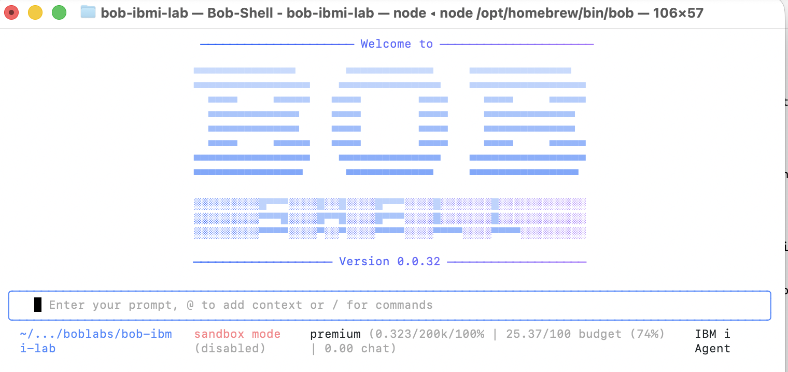

# Lab 101-4: IBM Bob with IBM i MCP - 15 Minute Hands-On Lab

**Duration**: 15 minutes  
**Level**: Intermediate  
**Prerequisites**: 
- IBM Bob installed and running
- Access to an IBM i system with Mapepire server running (port 8076)
- Basic familiarity with command line

## Lab Overview

In this hands-on lab, you'll configure IBM Bob to work with IBM i systems using the Model Context Protocol (MCP). You'll set up custom modes, connect to your IBM i system, and execute your first queries using Bob's AI-powered interface.

## What You'll Learn

- How to configure Bob for IBM i development with MCP and modes
- How to use IBM i-specific AI agent modes
- How to query IBM i systems using natural language
- How to leverage pre-built IBM i tools

## Lab Setup (5 minutes)

### Step 1: Create Project Structure

Create a new directory for this lab:

```bash
mkdir bob-ibmi-lab
cd bob-ibmi-lab
mkdir -p .bob/tools
```

### Step 2: Download Configuration Files

Clone or download the IBM i MCP Server repository:

```bash
git clone https://github.com/IBM/ibmi-mcp-server.git
```

Copy the required configuration files:

```bash
# Copy custom modes
cp ibmi-mcp-server/.bobmodes .

# Copy MCP configuration
cp ibmi-mcp-server/.bob/mcp.json.example .bob/mcp.json

# Copy example tools
cp -r ibmi-mcp-server/tools .bob/

# Remove temporary files 
rm -rf ibmi-mcp-server
```

### Step 3: Configure IBM i Connection

Create a `.env` file in your project root with your IBM i credentials:

```bash
# .env file
DB2i_HOST=your-ibmi-hostname.com
DB2i_USER=YOURUSER
DB2i_PASS=yourpassword
DB2i_PORT=8076
```

**Important**: Add `.env` to `.gitignore`:

```bash
echo ".env" >> .gitignore
```

### Step 4: Update MCP Configuration

Edit `.bob/mcp.json` to use the `.env` file (remove credential references):

```json
{
    "mcpServers": {
        "ibmi-mcp-server": {
            "command": "npx",
            "args": [
                "@ibm/ibmi-mcp-server",
                "--tools",
                "${workspaceFolder}/.bob/tools"
            ],
            "cwd": "${workspaceFolder}",
            "env": {
                "NODE_OPTIONS": "--no-deprecation --no-warnings",
                "MCP_TRANSPORT_TYPE": "stdio",
                "YAML_ALLOW_DUPLICATE_SOURCES": "true"
            },
            "disabled": false,
            "alwaysAllow": []
        },
        "ibmi-mcp-docs": {
            "type": "streamable-http",
            "url": "https://ibm-d95bab6e.mintlify.app/mcp"
        }
    }
}
```

### Step 5: Restart Bob

Close and reopen IBM Bob to load the new configuration.

## Exercise 1: Verify Setup (2 minutes)

**Objective**: Confirm Bob is properly configured for IBM i.

1. Open Bob in your `bob-ibmi-lab` directory
2. Ask Bob: `"What custom modes are available?"`
3. Expected response: Bob should list "IBM i Agent" and "IBM i MCP Tool Builder" modes
4. Ask Bob: `"What MCP servers are connected?"`
5. Expected response: Bob should show `ibmi-mcp-server` and `ibmi-mcp-docs` as connected

**✅ Success Criteria**: Both custom modes are listed and both MCP servers show as connected.

## Exercise 2: Switch to IBM i Agent Mode (2 minutes)

**Objective**: Activate the IBM i-specific AI agent.

1. Ask Bob: `"Switch to IBM i Agent mode"`
2. Bob should confirm the mode switch
3. Ask Bob: `"What can you help me with?"`
4. Bob should describe its IBM i capabilities

**✅ Success Criteria**: Bob confirms it's in IBM i Agent mode and describes IBM i-specific capabilities.

## Exercise 3: Query System Status (3 minutes)

**Objective**: Use Bob to check your IBM i system's performance.

1. Ask Bob: `"Show me the current system status"`
2. Bob should execute the `system_status` tool and display:
   - CPU utilization
   - Memory usage
   - I/O statistics
   - Active jobs count

**Sample Questions to Try**:
- `"What is the current CPU usage?"`
- `"How many jobs are currently active?"`
- `"Show me memory pool information"`

**✅ Success Criteria**: Bob returns formatted system performance data from your IBM i system.

## Exercise 4: Explore Database Objects (3 minutes)

**Objective**: Use Bob to explore your IBM i database.

1. Ask Bob: `"List all service categories available on IBM i"`
2. Bob should show categories like "System Administration", "Performance", "Security", etc.
3. Ask Bob: `"Search for services related to 'job' in their name"`
4. Bob should list job-related SQL services

**Sample Questions to Try**:
- `"What services are available in the Performance category?"`
- `"Show me an example of using the ACTIVE_JOB_INFO service"`
- `"List tables in the QSYS2 schema"`

**✅ Success Criteria**: Bob successfully queries and displays IBM i service information.

## Exercise 5: Security Analysis (Optional - 2 minutes)

**Objective**: Use Bob to perform a basic security check.

1. Ask Bob: `"Show me users with limited capabilities"`
2. Bob should execute the security tool and display results
3. Ask Bob: `"Are there any database files readable by any user?"`

**⚠️ Note**: These queries require appropriate security authorities on your IBM i system.

**✅ Success Criteria**: Bob executes security analysis tools and returns results (or explains permission requirements).

## Exercise 6: Using Bob CLI (3 minutes)

**Objective**: Learn to use Bob from the command line for general IBM i assistance.

Bob provides a CLI that allows you to interact with AI agents from the terminal, making it perfect for quick questions, code generation, and documentation lookup.


### Step 1: Verify Bob CLI is Available

Check if Bob CLI is installed:

```bash
bob --version
```

If not installed, follow the Bob CLI installation instructions for your platform.

### Step 2: Update MCP Configuration for CLI

Bob CLI can require a few changes in the MCP configuration. Update your `.bob/mcp.json` : 

1. **Find the full path to npx**:
```bash
which npx
# Example output: /opt/homebrew/bin/npx
```

2. **Get the full path to your project directory**:
```bash
pwd
# Example output: /Users/yourname/bob-ibmi-lab
```

3. **Update `.bob/mcp.json`** with full paths:

```json
{
    "mcpServers": {
        "ibmi-mcp-server": {
            "command": "/opt/homebrew/bin/npx",
            "args": [
                "@ibm/ibmi-mcp-server",
                "--tools",
                "/Users/yourname/bob-ibmi-lab/.bob/tools"
            ],
            "cwd": "/Users/yourname/bob-ibmi-lab",
            "env": {
                "NODE_OPTIONS": "--no-deprecation --no-warnings",
                "MCP_TRANSPORT_TYPE": "stdio",
                "YAML_ALLOW_DUPLICATE_SOURCES": "true",
                "DB2i_HOST": "your-ibmi-hostname.com",
                "DB2i_USER": "YOURUSER",
                "DB2i_PASS": "yourpassword",
                "DB2i_PORT": "8076"
            },
             "disabled": true,
            "timeout": 120,
            "alwaysAllow": []
        },
        "ibmi-mcp-server-http": {
            "type": "streamable-http",
            "url": "http://localhost:3010/mcp"
        },
        "ibmi-mcp-docs": {
            "type": "streamable-http",
            "url": "https://ibm-d95bab6e.mintlify.app/mcp"
        }
    }
}
```
**Important**: Add `mcp.json` to `.gitignore`:

```bash
echo ".bob/mcp.json" >> .gitignore
```

**Important**: Replace `/opt/homebrew/bin/npx` and `/Users/yourname/bob-ibmi-lab` with your actual paths.

### Step 3: Check Available Modes

Verify that Bob CLI can see your custom modes:

```bash
bob mcp list
```

You should see:
- `loaded project modes [ 'ibm-i-agent', 'ibmi-mcp-tool-builder' ]`
- MCP servers listed (may show as disconnected in CLI)

### Step 4: Use Bob Shell with IBM i Agent Mode

Launch Bob shell and interact with IBM i using the custom mode:

1. **Start Bob shell**:
```bash
bob 
```



2. **Switch to advanced mode**:
```
Switch to advanced mode with   /mode advanced , press enter
```
Bob should confirm the mode switch.

3. **Run a query in advanced mode**:
```
Show me the current system status
```

Bob should execute the `system_status` tool and display comprehensive IBM i system information including CPU, memory, jobs, and storage statistics.

4. **Exit Bob shell**:
```
Exit Bob shell with Ctrl+C Ctrl+C
```

**✅ Success Criteria**:
- Bob shell launches successfully
- Successfully switch to IBM i Agent mode
- Execute queries and receive IBM i system data
- Understand the difference between shell (interactive) and CLI (one-shot) usage

### Step 5: Run Live IBM i Queries from Command Line

With the MCP server connected, you can now run live queries against your IBM i system:

```bash
# System status (MCP tools work in any mode)
bob -p "Show me the current system status" --chat-mode advanced

# Active jobs
bob -p "Show me the top 5 CPU consumers" --chat-mode advanced

# Database exploration
bob -p "List tables in the SAMPLE schema" --chat-mode advanced

# Security checks
bob -p "Show me users with limited capabilities" --chat-mode advanced
```

**Important Notes:**
- Use `--chat-mode ask` for queries and `--chat-mode code` for code generation

### CLI Options Reference

Common Bob CLI options:
- `--chat-mode <mode>` - Specify chat mode: `plan`, `code`, `ask`, or `advanced`
- `--hide-intermediary-output` - Suppress extra output, show only final results
- `--max-coins <number>` - Set maximum cost limit (exits with code 1 if exceeded)
- `--help` - Show all available options

### MCP Server Management

```bash
# List configured MCP servers
bob mcp list

```

**✅ Success Criteria**: Successfully execute queries from the command line and understand CLI capabilities and limitations.

## Lab Completion Checklist

- [ ] Bob is configured with IBM i custom modes
- [ ] MCP servers are connected and working
- [ ] Successfully switched to IBM i Agent mode
- [ ] Retrieved system status information
- [ ] Explored IBM i services and database objects
- [ ] (Optional) Ran security analysis queries
- [ ] Used Bob CLI from the command line

## What You've Accomplished

Congratulations! You've successfully:

1. ✅ Configured IBM Bob for IBM i development
2. ✅ Connected Bob to your IBM i system via MCP
3. ✅ Used natural language to query IBM i system information
4. ✅ Explored IBM i SQL services and database objects
5. ✅ Leveraged pre-built tools for system monitoring
6. ✅ Automated IBM i queries using Bob CLI

## Next Steps   

### Create Custom Tools

Switch to IBM i MCP Tool Builder mode:

1. Ask Bob: `"Switch to IBM i MCP Tool Builder mode"`
2. Ask Bob: `"Help me create a tool to monitor job queues"`
3. Bob will guide you through creating a custom YAML tool definition

### Learn More

- [IBM i MCP Server Documentation](https://ibm-d95bab6e.mintlify.app/mcp)
- [Mapepire Setup Guide](https://ibm-d95bab6e.mintlify.app/mcp/setup-mapepire)
- [SQL Tools Guide](https://ibm-d95bab6e.mintlify.app/mcp/sql-tools/overview)
- [GitHub Repository](https://github.com/IBM/ibmi-mcp-server)

## Troubleshooting

### Bob doesn't show custom modes
- Verify `.bobmodes` file is in project root
- Restart Bob completely
- Check file syntax is valid YAML

### MCP server connection fails
- Verify `.env` file has correct credentials
- Ensure Mapepire is running on IBM i (port 8076)
- Test connectivity: `ping your-ibmi-hostname`
- Check firewall allows port 8076

### Tools return errors
- Verify your IBM i user has appropriate authorities
- Check Mapepire server logs on IBM i
- Ensure QSYS2 services are available on your system

### No data returned
- Confirm you're querying existing objects/schemas
- Check SQL syntax in tool definitions
- Verify database authorities for your user profile

## Feedback

This lab is part of the IBM i MCP Server project. If you have suggestions or find issues, please contribute at [GitHub](https://github.com/IBM/ibmi-mcp-server).

---

**Lab Complete!** You're now ready to use IBM Bob for IBM i development and system administration tasks.